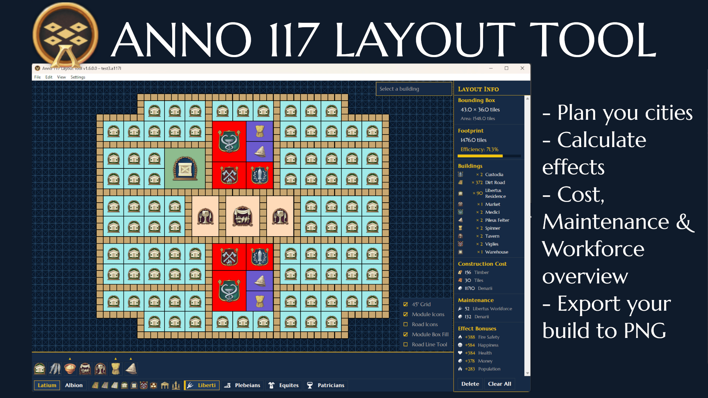

# Anno 117 Layout Tool

A tile-based layout planner for **Anno 117: Pax Romana**. Design city districts offline, experiment with production chains, visualise effect radii and street range, then export your finished layout as a PNG.



-> Deutsches Readme findet ihr [hier](README_de.md)

---

## How to use:

**Standalone executable** (Windows only):
Download the portable executable from the latest release. Place it anywhere on your PC and run it.

**Runing from commandline**:
- Python 3.10+
- Tkinter (bundled with standard Python on Windows; `python3-tk` on Linux)
- Pillow - `pip install Pillow`

```
pip install -r requirements.txt
python main.py
```

---

## Features

### Canvas & Navigation

- **Dual grid system** - 90° axis-aligned grid and optional 45° diagonal overlay; toggle via View menu or the bottom-right checkboxes
- **Pan** - middle-mouse drag
- **Zoom** - scroll wheel
- **Fit to view** - **Home** key or View → *Fit Layout to View*
- **Light / Dark mode** - toggle in the View menu; persisted across sessions
- **Overlay checkboxes** (bottom-right corner; persisted across sessions):
  - Show/Hide 45° Grid
  - Show/Hide Road/Aqueduct/Channel icons & outline
  - Show/Hide Module icons
  - Activate Module rectangle-fill tool
  - Activate Road straight-line tool

---

### Building Placement

Click a building in the build menu on the bottom of the main canvas to enter placement mode (crosshair cursor). A **ghost preview** follows the cursor; a **red collision tint** signals a blocked position. Click to place - placement mode stays active for repeated stamping.

- **Esc** or **right-click** exits build mode
- **Double-click** a placed building to re-enter build mode for the same type and rotation

#### Rotation

| Key | Action |
|-----|--------|
| `.` | Rotate CW 45° |
| `,` | Rotate CCW 45° |
| Middle-click (no drag) | CW 45° |

All eight orientations (0°–315° in 45° steps) are supported. Buildings snap to the correct grid family automatically.

#### Drag-placement modes

| Mode | Activation | Behaviour |
|------|-----------|-----------|
| Road / channel drag | Select any road or channel, then drag | Lays tiles along the drag path; higher-priority roads auto-evict lower ones (Dirt < Paved < Marble) |
| House block drag | Select a residence, then drag | Fills a max-2-wide, any-length block aligned to the drag axis |
| Module rectangle fill | Enable *Module Box Fill* checkbox | Drag anchor → corner to fill a rectangle of fields or modules |
| Road straight-line tool | Enable *Road Line Tool* checkbox | First click sets start point; second click lays a straight run |

---

### Selection & Multi-select

| Action | Behaviour |
|--------|-----------|
| Left-click | Select single building |
| Ctrl+click | Toggle building in / out of selection |
| Shift+click | Add building to selection (chaining) |
| Click-drag on empty canvas | Box-select all buildings inside the rectangle |
| Ctrl+A | Select all |
| Right-click | Deselect all / exit build mode |

---

### Copy, Paste & Move

| Shortcut | Action |
|----------|--------|
| Ctrl+C | Copy selected buildings |
| Ctrl+V | Paste - single building enters placement mode; multiple buildings follow the cursor as a group ghost |
| M | **Move mode** - lifts the selection out of the layout; click to place at new position; Esc restores originals |

Multi-building groups preserve each building's type, rotation, and relative spacing. Before placing, the group can be rotated:

- **Without roads in the selection** - rotates in 45° steps
- **With roads in the selection** - rotates in 90° steps (see *Known Issues*)

Dragging a multi-building selection moves the **entire group as a rigid block**: if any building would collide, the whole group holds position.

---

### Road Utilities

#### Road Swap (Shift+U)

Select exactly one road tile and press **Shift+U**. A small popup lists all other road types for the same region. Picking one replaces **every** road of the original type throughout the layout in one action.

#### Road Block Surround

With any road type selected, **click on a non-road building** to automatically place road tiles around the entire contiguous block that building belongs to - including diagonal corners. Works in both normal drag mode and straight-line tool mode. The surround respects road priority (higher-priority roads evict lower ones) and is grouped as a single undo step.

#### Effect Radius & Street Distance overlays

When a building with an effect is selected or previewed:

- **Gold dashed ring/street tile outline** - effect radius for productions/road tiles reachable within the street-distance budget for public buildings
- **Light blue ring** - module build radius (animal farms & free area buildings)
- **Buildings within range of the effect are highlighted green** on the canvas; roads, modules/fields, and same-type buildings are excluded from the counter
- **Attribute bonuses** are listed per in-range building (happiness, money, population, etc.), including bonuses granted through public-service needs (e.g. Tavern, Market)

Street-distance reach accounts for road quality: paved and marble road tiles count as 1.5× cheaper to traverse, effectively extending reach by 50% compared to dirt roads.

Active **Tech Effects** that increase a building's range (e.g. *Market Forces* +25%) are reflected in the radius overlay and the in-range counter in real time.

---

### Build Menu

- **Region tabs** - Roman (Latium) / Celtic (Albion) at the bottom; switches the entire building set
- **Tier tabs** - Liberti, Plebeians, Equites, Patricians (Roman) / Waders, Smiths, Aldermen, Mercators, Nobles (Celtic)
- **Fixed tabs** - Materials, Infrastructure, Ornaments
- **Quick-access bar** (per region) - Road, Paved Road, Marble Road, Residence, Warehouse, City Watch - one click to start placing
- **Production chain popups** - shows the full input → output tree; click a leaf to select for placement
- **Category popups** - sub-categories with nested popups

Popups stay open while you place buildings. They close on right-click or clicking empty canvas.

---

### Building Information Panel

Visible top-right of the canvas when a building is selected or being placed:

- Name, category, icon, tile dimensions, rotation
- Affected buildings count (for effect-radius buildings, updated live during drag)
- Attribute bonus summary - lists the total bonus each attribute receives across all in-range buildings, including bonuses delivered through public-service needs
- Free tiles in influence radius (forestry / cultivation buildings)
- **Upgrade** button - replaces the building in-place with the next-tier variant (residences, monuments, infrastructure buildings)
- **Module Build** button - enters module placement mode for this building. The modules are then parented to the selected building and counted towards its required number of modules for 100% base productivity. If two or more buildings with modules on them share a border, their colours automatically change so that you can see which modules belong to which building.
- **Tech Effects** button (appears when applicable) - opens a popup listing available research upgrades for this building. Toggle individual effects on or off; active effects are reflected immediately in the radius overlay, in-range count, and bonus totals.
- **Item Effects** button (appears when applicable) - opens a popup listing available item upgrades for this building. Toggle individual effects on or off; active effects are reflected immediately in the building infopanel and totals. Item effects are copy/paste consistent.
- Construction and maintenance cost breakdown

---

### Layout Info Panel

Always visible in the right sidebar:

- Per-type building counts
- Aggregated construction and maintenance costs
- Aggregated attributes generated by the layout
- Bounding box dimensions, compact footprint area, **layout efficiency %**

All figures update live.

---

### Undo / Redo

| Shortcut | Action |
|----------|--------|
| Ctrl+Z | Undo (up to 50 levels) |
| Ctrl+Y | Redo |

Each major action - place, delete, move, road-swap, paste - creates one undo step. Multi-tile drag operations are grouped as one step.

---

### Save / Load / Export

| Shortcut | Action |
|----------|--------|
| Ctrl+N | New layout |
| Ctrl+O | Open layout |
| Ctrl+S | Save (Save As if no path yet) |

**Format**: `.a117l` (JSON). Stores each building's GUID, grid position, rotation, and module parent links.

**PNG export** (File → *Export as PNG…*):
- Optional checkbox to append the Layout Info statistics panel on the right side of the image in the View settings.
- 90° Grid overlaid at a fixed tile size; building icons aare shown

---

### Island & Savegame Import

The tool can overlay a Anno 117 island map on the canvas as a planning background, and optionally pre-populate it with every building that already exists in your savegame.

#### Load Island (Ctrl+I)

*File → Load Island…* opens a picker listing all island outlines bundled with the tool. Selecting one draws the island terrain on the canvas as a coloured background layer. No external tools or game installation are required. Use this when you want to plan a layout on a known island shape from scratch.

- The island overlay moves and zooms with the canvas.
- **File → Clear Island** removes it without affecting placed buildings.
- The island is saved as part of the `.a117l` layout file and restored on load.

#### Island tile colours

The background uses five distinct colours to communicate what each tile can be used for:

| Colour (dark / light) | Tile type | Meaning |
|-----------------------|-----------|---------|
| Dark navy / saturated blue | Sea | Open sea - no buildings |
| Dark brown / sandy stone | Land | Non-buildable terrain (cliffs, mountains, rivers) |
| Forest green / grass green | Buildable | Regular buildable land |
| Deep blue / coastal blue | Harbour | Buildable coastal water (harbour zone) |
| Olive-yellow / yellow-green | Marsh | Marsh area (buildable) |

The tool enforces these boundaries: buildings placed outside buildable tiles are shown with a red collision tint and cannot be confirmed.

#### Import Savegame (Ctrl+G)

*File → Import Savegame…* reads a live Anno 117 save file (`.a8s`) and imports both the island terrain **and** all buildings that are already placed there directly into the canvas - useful for documenting an existing city or continuing to plan around it.

**Prerequisites:** the import requires two free tools from the Anno Modding Community that the app will offer to download automatically on first use:

- **RdaConsole** - extracts files from the `.a8s` archive
- **FileDBReader** - decodes the binary island data

.NET 6 or newer must be installed on your machine. If the tools are not found on first launch, a setup dialog opens; click **Download** to fetch them automatically from GitHub.

**How to use:**

1. Press **Ctrl+G** or go to *File → Import Savegame…*
2. If the tools are missing, complete the one-time setup dialog.
3. Browse to your Anno 117 save file (default location: `Documents\Anno 117 - Pax Romana\accounts\<account-id>\`). Save files use the `.a8s` extension.
4. A progress dialog parses the savegame in the background and lists all playable islands it contains.
5. Select the island you want and click **Import to Canvas**.

After a savegame is imported, *File → Switch Savegame Island…* lets you switch to a different island from the same save without re-selecting the file.

> **Note:** Blueprint buildings (not yet fully constructed) are excluded from the import.

---

### Settings & Localisation

- **12 languages**: English, Deutsch, Français, Español, Italiano, Polski, Русский, Português (BR), 日本語, 한국어, 简体中文, 繁體中文
- Language chosen on first run; change at any time via Settings → *Change Language…*
- Per-building and per-category colour overrides; reset to default via Settings → *Reset Building Colours…*
- All preferences saved to `%APPDATA%\Anno 117 Layout Tool\settings.json`

---

## Full Keyboard Shortcut Reference

| Shortcut | Action |
|----------|--------|
| Ctrl+N | New layout |
| Ctrl+O | Open layout |
| Ctrl+S | Save |
| Ctrl+G | Import savegame |
| Ctrl+I | Load island |
| Ctrl+Z | Undo |
| Ctrl+Y | Redo |
| Ctrl+A | Select all |
| Ctrl+C | Copy selected |
| Ctrl+V | Paste |
| M | Move mode |
| Delete | Delete selected / exit build mode |
| Esc | Exit build mode / cancel |
| `.` | Rotate CW 45° (or 90° with roads selected) |
| `,` | Rotate CCW 45° (or 90° with roads selected) |
| Shift+U | Road swap (one road tile selected) |
| Home | Fit layout to view |
| Middle-click (no drag) | Rotate 90° |
| Middle-drag | Pan canvas |
| Scroll wheel | Zoom |
| Shift+Scroll (over menu strip) | Horizontal scroll |

---

## Known Issues

**Rotation with roads in the selection is limited to 90° steps.**
Rotating a mixed group of residences and road tiles in 45° increments would cross the 90°/45° grid-family boundary, which the road geometry cannot resolve correctly. The tool automatically upgrades each key press to a 90° step when any road tile is in the selection. Selections without roads still rotate in 45° steps as normal.

**Rigid group movement can feel unresponsive near obstacles.**
When dragging multiple buildings, the entire group moves only if every building has a valid position at the new location. If one building at the edge clips a wall or existing structure, the whole group holds. Deselect the blocking building and move the rest separately.

**Street distance reach is approximate in dense 45° road networks.**
The BFS graph is built from polygon adjacency; in very dense diamond-road layouts the reachable hop count may differ by ±1 from the in-game value.

**Performance is reduced on large savegame-imported islands.**
Importing a fully developed island from a late-game savegame can result in 5,000–10,000+ placed buildings on the canvas. Panning, placing additional buildings, and computing street-distance overlays for public buildings (markets, taverns, etc.) may feel slower under these conditions compared to a hand-built layout of smaller size. This is a known limitation of the rendering pipeline at this scale; no data is lost and all features remain functional.

**Production chain popups reflect base-game data only.**
Modded or custom production chains are not shown. Although Obsidian input is shown as part of some production chains, clicking the icon does not open a placeable building in the canvas. This is because it can only be generated as an additional output in other buildings.

### License:
MIT

### Credits:
- DuxVitae for his incredible work on the Anno 117 [Asset Extractor](https://github.com/anno-mods/asset-extractor), which I used to generate the extractor scripts to extract all the data necessary for this project
- Oliver Saggau for his detailed documentation on both Anno 117 [savegame files](https://github.com/oliversaggau/anno-designer/blob/Savegames/AnnoDesigner.Import/docs/Anno117_Savegames.md) and [island files](https://github.com/oliversaggau/anno-designer/blob/Savegames/IslandOutlinesExtractor/README.md) in his branch of the updated Anno Designer. They helped immensely with setting up these functions in the app.
- Claude Code for making my vision of a layout tool for Anno 117 come true

---

*For questions, bug reports, and contributions, please open an issue or pull request on the [GitHub repository](https://github.com/taludas/anno-117-layout-tool).*