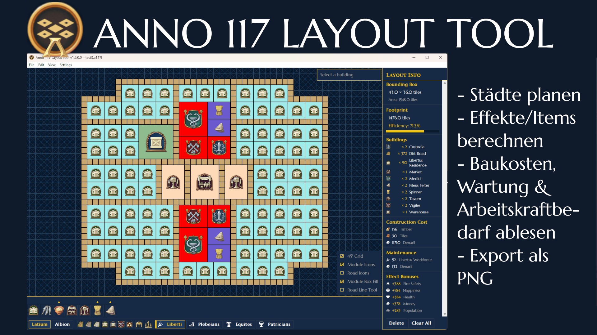

# Anno 117 Layout Tool

Ein kachelbasierter Layout-Planer für **Anno 117: Pax Romana**. Plane deine Stadtbezirke und Produktionsketten offline, visualisiere Wirkungsradien und Straßenreichweiten und exportiere dein fertiges Layout als PNG.



---

## Voraussetzungen

**Standalone-Executable** (Windows only):
Ladet die exe Datei aus der neuesten Release-Version herunter. Speichert sie an einem beliebigen Ort auf eurem PC und führt sie aus.

**Commandline**:
- Python 3.10+
- Tkinter (unter Windows im Python-Standard-Bundle enthalten; unter Linux: `python3-tk`)
- Pillow - `pip install Pillow`

```
pip install -r requirements.txt
python main.py
```

---

## Features

### Benutzeroberfläche & Navigation

- **Duales Raster** - 90°-Raster und optionales 45°-Diagonalraster wie im Spiel; 45° Grid einschaltbar über das Ansicht-Menü oder die Checkboxen unten rechts
- **Schwenken** - mittlere Maustaste gedrückt halten und ziehen
- **Zoomen** - Mausrad
- **An Layout anpassen** - **Pos1**-Taste oder Ansicht → *Layout in Ansicht einpassen*
- **Hell-/Dunkelmodus** - im Ansicht-Menü umschaltbar, wird sitzungsübergreifend gespeichert
- **Overlay-Checkboxen** (unten rechts):
  - 45°-Raster
  - Straßen-/Kanal-Icons & Umrisse
  - Modul-Icons
  - Modul-Rechteckfüllung aktivieren
  - Grade-Straßen-Werkzeug aktivieren

---

### Gebäudeplatzierung

Klicke ein Gebäude im Baumenü an, um den Baumodus zu aktivieren (Gebäude hängen an einem Fadenkreuz-Cursor). Eine **Vorschau** folgt dem Mauszeiger; **rote Kollisionsfarbe** signalisiert eine blockierte Position. Ein Klick auf die Benutzeroberfläche platziert das Gebäude an einer freien Stelle - der Baumodus bleibt für wiederholtes Setzen aktiv.

- **Esc** oder **Rechtsklick** beendet den Baumodus
- **Doppelklick** auf ein platziertes Gebäude kehrt in den Baumodus für denselben Typ in der selben Rotation zurück (Pipette)

#### Rotation

| Taste | Aktion |
|-------|--------|
| `.` | 45° im Uhrzeigersinn |
| `,` | 45° gegen den Uhrzeigersinn |
| Mittlere Maustaste (kein Ziehen) | 45° im Uhrzeigersinn |

Alle acht Orientierungen (0°–315°, in 45°-Schritte) werden unterstützt. Gebäude rasten automatisch in die korrekte Grid-Familie ein.

#### Komfort-Baumodi

| Modus | Aktivierung | Verhalten |
|-------|------------|-----------|
| Straßen-Werkzeug | Straße oder Kanal auswählen, dann ziehen | Platziert Kacheln entlang des Ziehpfades; höherwertige Straßen verdrängen niederwertige automatisch (Dirt < Paved < Marble) |
| Wohnblock-Werkzeug | Wohngebäude auswählen, dann ziehen | Füllt einen max. 2 Gebäude breiten, beliebig langen Block entlang der Zugrichtung |
| Modul-Rechteckfüllung | Checkbox *Modul-Rechteckfüllung* aktivieren | Anker → Ecke ziehen, um ein Rechteck mit Feldern oder Modulen zu füllen |
| Grade-Straßen-Werkzeug | Checkbox *Grade-Straßen-Werkzeug* aktivieren | Erster Klick setzt Startpunkt; zweiter Klick verlegt eine gerade Reihe bis zum Endpunkt |

---

### Auswahl & Mehrfachauswahl

| Aktion | Verhalten |
|--------|-----------|
| Linksklick | Einzelnes Gebäude auswählen |
| Strg+Klick | Gebäude zur Auswahl hinzufügen / daraus entfernen |
| Shift+Klick | Gebäude zur Auswahl hinzufügen (Verkettung) |
| Klick+Ziehen auf leerer Benutzeroberfläche | Alle Gebäude im Rechteck auswählen |
| Strg+A | Alle auswählen |
| Rechtsklick | Auswahl aufheben / Baumodus beenden |

---

### Kopieren, Einfügen & Verschieben

| Kürzel | Aktion |
|--------|--------|
| Strg+C | Ausgewählte Gebäude kopieren |
| Strg+V | Einfügen - einzelnes Gebäude: Baumodus; mehrere Gebäude: Gruppenvorschau folgt dem Cursor |
| M | **Verschiebemodus** - hebt die Auswahl aus dem Layout heraus; Klick zum Platzieren an neuer Position; Esc stellt Originale wieder her |

Mehrgebäude-Gruppen bewahren Typ, Rotation und relativen Abstand jedes Gebäudes. Vor dem Platzieren kann die Gruppe rotiert werden:

- **Ohne Straßen in der Auswahl** - Rotation in 45°-Schritten
- **Mit Straßen in der Auswahl** - Rotation in 90°-Schritten (siehe *Bekannte Probleme*)

Beim Ziehen einer Mehrfachauswahl bewegt sich die gesamte Gruppe **starr als Block**: Wenn ein Gebäude kollidieren würde, bleibt die ganze Gruppe stehen.

---

### Straßen-Werkzeuge

#### Straßentausch (Shift+U)

Eine einzelne Straßenkachel auswählen und **Shift+U** drücken. Ein kleines Popup listet alle anderen Straßentypen für dieselbe Region auf. Die Auswahl ersetzt **alle** Kacheln des ursprünglichen Straßentyps im Layout auf einen Schlag.

#### Effektradien & Straßenreichweite

Wenn ein Gebäude mit Effektradius ausgewählt oder in der Vorschau ist:

- **Goldener gestrichelter Ring** - Effektradius für Produktionsgebäude/Straßenkacheln, die innerhalb des "Entfernungsbudgets" für das öffentliche Gebäude erreichbar sind
- **Hellblauer Ring** - Modulbauradius (Tier-Farmen & Gebäude mit freien Kacheln im Radius)
- **Vom Effekt betroffene Gebäude werden grün hervorgehoben**: Straßen, Module/Felder und Gebäude desselben Typs sind vom Effekt ausgenommen
- **Attributboni** werden pro Gebäude innerhalb der Reichweite aufgeführt (Zufriedenheit, Geld, Bevölkerung usw.), einschließlich der Boni, die durch öffentliche Gebäude (z. B. Taverne, Markt) gewährt werden.


Die Straßenreichweite berücksichtigt die Straßenqualität: Gepflasterte Straßen und Marmorstraßen kosten 1,5× weniger Wegpunkte, was die Reichweite gegenüber Feldwegen um 50 % erhöht.

Aktive **Tech-Effekte**, die die Reichweite eines Gebäudes erhöhen (z. B. *Attraktive Märkte* +25 %), werden in Echtzeit in der Reichweitenanzeige und im Reichweitenzähler angezeigt.

---

### Baumenü

- **Regions-Tabs** - Römisch (Latium) / Keltisch (Albion); wechselt den gesamten Gebäudesatz
- **Klassen-Tabs** - Liberti, Plebejer, Equites, Patrizier (Römisch) / Wanderer, Schmiede, Älteste, Merkatoren, Adlige (Keltisch)
- **Feste Tabs** - Materialien, Infrastruktur, Ornamente
- **Schnellzugriff-Leiste** (je Region) - Straße, Gepflasterte Straße, Marmorstraße, Wohngebäude, Lagerhaus, Stadtwachen
- **Produktionsketten-Popups** - zeigt den vollständigen Produktions-Baum; Klick auf ein Produkt wählt es zur Platzierung aus
- **Kategorie-Popups** - verschachtelte Popups für Unterkategorien, z.B. bei Ornamenten

Popups bleiben offen, während Gebäude platziert werden. Sie schließen sich bei Rechtsklick oder Klick auf die leere Benutzeroberfläche.

---

### Gebäudeinformationspanel

Sichtbar oben rechts auf der Benutzeroberfläche, wenn ein Gebäude ausgewählt oder in der Vorschau ist:

- Name, Kategorie, Icon, Kachelabmessungen, Rotation
- Anzahl betroffener Gebäude (für Effektradius-Gebäude, live aktualisiert beim Verschieben)
- Freie Kacheln im Einflussradius (Gebäude mit freien Kacheln im Radius)
- **Upgrade-Schaltfläche** - ersetzt das Gebäude direkt durch die nächste Stufe (Wohnhäuser, Monumente, Infrastruktur)
- **Modul bauen-Schaltfläche** - Wechselt in den Modulplatzierungsmodus für dieses Gebäude. Die Module werden dann dem ausgewählten Gebäude zugeordnet und auf dessen erforderliche Modulanzahl für die Basisproduktivität von 100 % angerechnet. Wenn zwei oder mehr Gebäude mit Modulen eine gemeinsame Grenze haben, ändern sich ihre Farben automatisch, sodass man besser erkennen kann, welche Module zu welchem Gebäude gehören.
- **Tech-Effekte-Schaltfläche** (wird angezeigt, sofern verfügbar) – öffnet ein Popup-Fenster mit einer Liste der verfügbaren Forschungs-Upgrades für dieses Gebäude. Hier können einzelne Effekte ein- oder ausgeschaltet werden; aktive Effekte werden sofort in der Radius-Einschlagskarte, der Anzahl der Ziele im Wirkungsbereich und den Bonussummen angezeigt.
- **Itemeffekte-Schaltfläche** (wird angezeigt, sofern verfügbar) – öffnet ein Popup-Fenster mit einer Liste der verfügbaren Item-Upgrades für dieses Gebäude. Hier können einzelne Effekte ein- oder ausgeschaltet werden; aktive Effekte werden sofort im Informationsfeld des Gebäudes und in den Gesamtwerten angezeigt. Itemeffekte sind copy/paste beständig.
- Aufschlüsselung der Bau- und Unterhaltskosten

---

### Layout-Infopanel

Immer in der rechten Seitenleiste sichtbar:

- Gebäudeanzahl pro Typ
- Summierte Bau- und Unterhaltskosten
- Summe der vom Layout generierte Attribute
- Begrenzungsrahmen-Abmessungen, kompakter Flächenbedarf, **Layout-Effizienz %**

Alle Werte werden live aktualisiert.

---

### Rückgängig / Wiederholen

| Kürzel | Aktion |
|--------|--------|
| Strg+Z | Rückgängig (bis zu 50 Schritte) |
| Strg+Y | Wiederholen |

Jede größere Aktion - Platzieren, Löschen, Verschieben, Straßentausch, Einfügen - erzeugt einen Rückgängig-Schritt. Mehrkachelige Ziehvorgänge werden als ein Schritt zusammengefasst.

---

### Speichern / Laden / Exportieren

| Kürzel | Aktion |
|--------|--------|
| Strg+N | Neues Layout |
| Strg+O | Layout öffnen |
| Strg+S | Speichern (Speichern unter, wenn noch kein Pfad festgelegt) |

**Format**: `.a117l` (JSON intern). Speichert GUID, Rasterposition, Rotation und Modul-Verknüpfungen jedes Gebäudes.

**PNG-Export** (Datei → *Als PNG exportieren…*):
- Optionale Checkbox fügt das Statistik-Panel rechts neben der Benutzeroberfläche ein
- 90°-Raster mit fester Kachelgröße überlagert von den Gebäuden; Gebäudesymbole werden angezeigt

---

### Insel- & Spielstand-Import

Das Tool kann eine Anno-117-Insel als Planungshintergrund auf die Benutzeroberfläche legen und optional alle Gebäude, die im Spielstand bereits vorhanden sind, übernehmen.

#### Insel laden (Strg+I)

*Datei → Insel laden…* öffnet eine Auswahlliste aller im Tool enthaltenen Inseln. Nach der Auswahl wird die Inselgeländeform als farbige Hintergrundebene auf der Benutzeroberfläche eingeblendet. Externe Werkzeuge oder eine Spielinstallation sind dafür nicht erforderlich. Diese Option eignet sich, wenn man ein Layout auf einer bekannten Inselform von Grund auf neu planen möchte.

- Die Insel-Überlagerung bewegt sich und zoomt zusammen mit der Benutzeroberfläche.
- **Datei → Insel entfernen** löscht sie, ohne platzierte Gebäude zu beeinflussen.
- Die Insel wird als Teil der `.a117l`-Layoutdatei gespeichert und beim Laden wiederhergestellt.

#### Kachelfarben der Insel

Der Hintergrund nutzt fünf verschiedene Farben, um anzuzeigen, wie die jeweilige Kachel genutzt werden kann:

| Farbe (Dunkel / Hell) | Kacheltyp | Bedeutung |
|-----------------------|-----------|-----------|
| Dunkles Marineblau / Sattblau | Meer | Offenes Meer - keine Bebauung möglich |
| Dunkelbraun / Sandstein | Gelände | Nicht bebaubares Terrain (Klippen, Berge, Flüsse) |
| Waldgrün / Grasgrün | Bebaubar | Normales bebaubares Land |
| Tiefblau / Küstenblau | Hafen | Bebaubarer Küstenbereich (Hafen) |
| Olivgelb / Gelbgrün | Sumpf | Sumpffläche (bebaubar) |

Das Tool erzwingt diese Grenzen: Gebäude, die außerhalb von bebaubareren Kacheln platziert werden, erhalten eine rote Kollisionsfarbe und können nicht gesetzt werden.

#### Spielstand importieren (Strg+G)

*Datei → Spielstand importieren…* liest eine Anno-117-Speicherdatei (`.a8s`) ein und importiert sowohl die Inselgeländeform **als auch** alle dort bereits platzierten Gebäude direkt in die Benutzeroberfläche - praktisch, um eine bestehende Stadt zu dokumentieren oder rund um sie weiterzuplanen.

**Voraussetzungen:** Für den Import werden zwei kleine Programme der Anno Community benötigt, die die App beim ersten Aufruf automatisch zum Download anbietet:

- **RdaConsole** - entpackt Dateien aus dem `.a8s`-Archiv
- **FileDBReader** - dekodiert die binären Inseldaten

Auf dem Rechner muss **.NET 6 oder neuer** installiert sein. Werden die Tools beim ersten Start nicht gefunden, öffnet sich ein Einrichtungsdialog; ein Klick auf **Download** lädt sie automatisch von GitHub herunter und installiert sie.

**Ablauf:**

1. **Strg+G** drücken oder *Datei → Spielstand importieren…* aufrufen.
2. Falls die Tools fehlen, den einmaligen Einrichtungsdialog abschließen.
3. Die Anno-117-Speicherdatei auswählen (Standardpfad: `Dokumente\Anno 117 - Pax Romana\accounts\<Konto-ID>\`). Speicherdateien haben die Endung `.a8s`.
4. Ein Fortschrittsdialog lädt den Spielstand im Hintergrund und listet alle spielereigenen Inseln auf.
5. Die gewünschte Insel auswählen und auf **Import to Canvas** klicken.

Nach einem Import lässt sich über *Datei → Spielstand-Insel wechseln…* ohne erneute Dateiauswahl zu einer anderen Insel desselben Spielstands wechseln.

> **Hinweis:** Gebäude im Blaupausenzustand (noch nicht fertig gebaut) werden beim Import ausgelassen.

---

### Einstellungen & Lokalisierung

- **12 Sprachen**: English, Deutsch, Français, Español, Italiano, Polski, Русский, Português (BR), 日本語, 한국어, 简体中文, 繁體中文
- Sprachauswahl beim ersten Start; Änderung jederzeit über Einstellungen → *Sprache ändern…*
- Individuelle Farbanpassungen pro Gebäude und Kategorie; Zurücksetzen über Einstellungen → *Gebäudefarben zurücksetzen…*
- Alle Einstellungen werden in `%APPDATA%\Anno 117 Layout Tool\settings.json` gespeichert

---

## Tastaturkürzel-Übersicht

| Kürzel | Aktion |
|--------|--------|
| Strg+N | Neues Layout |
| Strg+O | Layout öffnen |
| Strg+S | Speichern |
| Strg+G | Spielstand importieren |
| Strg+I | Insel laden |
| Strg+Z | Rückgängig |
| Strg+Y | Wiederholen |
| Strg+A | Alle auswählen |
| Strg+C | Ausgewählte kopieren |
| Strg+V | Einfügen |
| M | Verschiebemodus |
| Entf | Ausgewählte löschen / Baumodus beenden |
| Esc | Baumodus beenden / Abbrechen |
| `.` | 45° im Uhrzeigersinn (mit Straßen: 90°) |
| `,` | 45° gegen den Uhrzeigersinn (mit Straßen: 90°) |
| Shift+U | Straßentausch (wenn eine Straßenkachel ausgewählt ist) |
| Pos1 | Layout in Ansicht einpassen |
| Mittlere Maustaste (kein Ziehen) | 45°-Drehung |
| Mittlere Maustaste + Ziehen | Benutzeroberfläche schwenken |
| Mausrad | Zoomen |
| Shift+Mausrad (über Menüleiste) | Horizontal scrollen |

---

## Bekannte Probleme

**Rotation mit Straßen in der Auswahl ist auf 90°-Schritte begrenzt.**
Das Rotieren einer gemischten Gruppe aus Wohngebäuden und Straßenkacheln in 45°-Schritten würde die 90°/45°-Gitterfamiliengrenze überschreiten, was die Straßengeometrie nicht korrekt auflösen kann. Das Tool wandelt den Tastendrück automatisch in einen 90°-Schritt um, wenn Straßenkacheln in der Auswahl vorhanden sind. Auswahlen ohne Straßen rotieren weiterhin in 45°-Schritten.

**Gruppenverschieben kann sich in der Nähe von Hindernissen unresponsiv anfühlen.**
Beim Ziehen mehrerer Gebäude bewegt sich die gesamte Gruppe nur, wenn alle Gebäude an der neuen Position kollisionsfrei platziert werden können. Blockiert ein Gebäude am Rand der Gruppe, bleibt die gesamte Gruppe stehen. In diesem Fall das blockierende Gebäude aus der Auswahl entfernen und den Rest separat verschieben.

**Straßenreichweite ist in dichten 45°-Straßennetzen näherungsweise.**
Der BFS-Graph basiert auf Polygon-Adjacency-Tests; in sehr dichten Straßennetzen kann die ermittelte Hop-Anzahl um ±1 vom Spielwert abweichen.

**Performance ist bei großen, aus Spielständen importierten Inseln eingeschränkt.**
Das Importieren einer voll ausgebauten Insel aus einem Spielstand im späten Spielverlauf kann 5.000–10.000 oder mehr platzierte Gebäude auf die Benutzeroberfläche laden. Schwenken, das Platzieren weiterer Gebäude und die Berechnung von Straßenreichweiten für öffentliche Gebäude (Märkte, Tavernen usw.) kann unter diesen Bedingungen langsamer sein als bei einem manuell erstellten kleinen Layout. Dies ist eine bekannte Einschränkung der Rendering-Pipeline bei dieser Skalierung; alle Daten bleiben erhalten und alle Funktionen sind weiterhin nutzbar.

**Produktionsketten-Popups zeigen nur Basis-Spieldaten.**
Modifizierte oder gemoddete Produktionsketten werden nicht angezeigt.

### Lizenz:
MIT

### Credits:
- DuxVitae für seine großartige Arbeit am Anno 117 [Asset Extractor](https://github.com/anno-mods/asset-extractor), mit dessen Hilfe ich die Skripte erstellt habe, um alle für dieses Projekt erforderlichen Daten zu extrahieren
- Oliver Saggau für seine ausführliche Dokumentation sowohl zu den [Savegames](https://github.com/oliversaggau/anno-designer/blob/Savegames/AnnoDesigner.Import/docs/Anno117_Savegames.md) als auch zu den [Insel-Dateien](https://github.com/oliversaggau/anno-designer/blob/Savegames/IslandOutlinesExtractor/README.md) in seinem Branch des aktualisierten Anno Designers. Sie haben enorm dabei geholfen, diese Funktionen in meiner App zu implementieren.
- Claude-Code zur Umsetzung meiner Vision eines Layout-Tools für Anno 117

---

*Bei Fragen, Fehlermeldungen und Beiträgen eröffnet bitte ein Issue oder einen Pull Request auf dem [GitHub repository](https://github.com/taludas/anno-117-layout-tool).*